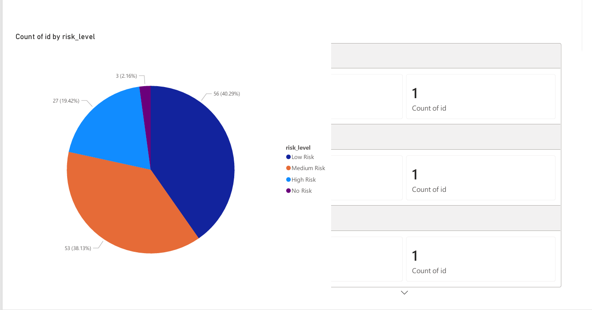
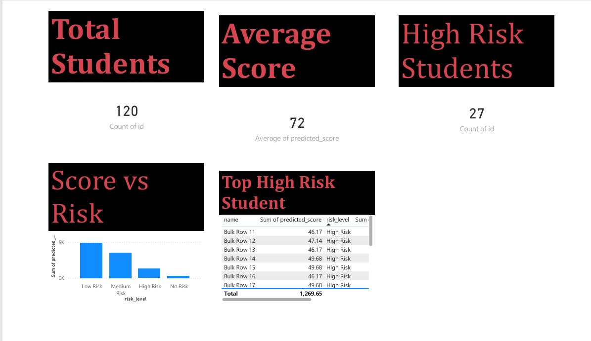
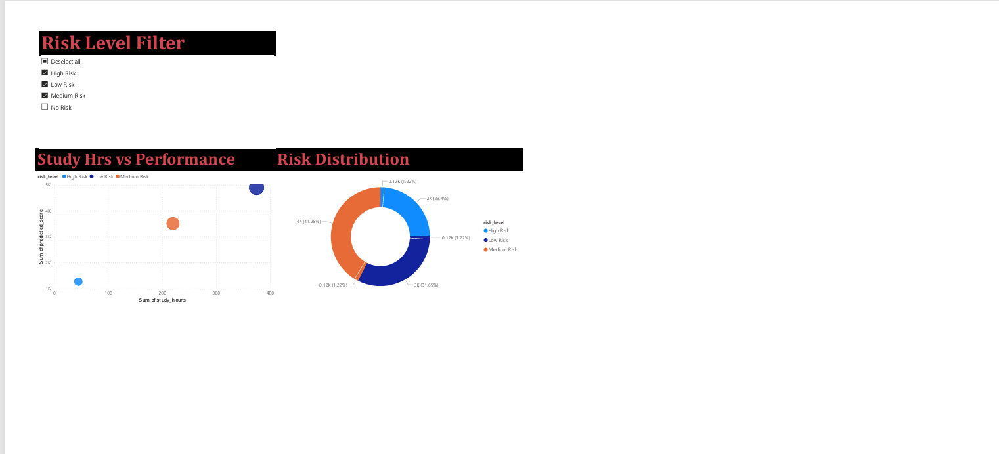
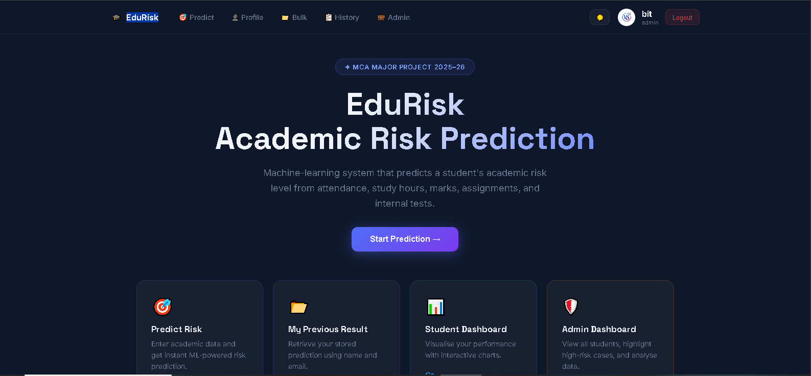

<div align="center">


# 🎓 EduRisk — Early Academic Risk Detection System

### AI-Powered Student Performance Prediction with Explainable Insights

[](https://python.org)
[](https://flask.palletsprojects.com)
[](https://reactjs.org)
[](https://mysql.com)
[](https://xgboost.readthedocs.io)
[](https://docker.com)
[](LICENSE)

**EduRisk** is a full-stack, AI-driven web application that predicts a student's academic risk level using a dual-model Machine Learning pipeline (Random Forest + XGBoost). It provides Explainable AI (XAI) insights via SHAP, what-if simulations, personalized recommendations, and a complete administrative analytics dashboard — all secured with JWT authentication and OTP email verification.

[🚀 Features](#-features) · [🏗️ Architecture](#️-architecture) · [📁 Folder Structure](#-folder-structure) · [🛠️ Installation](#️-installation) · [📡 API Reference](#-api-reference) · [🤖 Machine Learning](#-machine-learning-pipeline) · [📸 Screenshots](#-screenshots)

</div>

---

## ✨ Features

### 🎓 Student Features

- **Academic Risk Prediction** — Submit attendance, study hours, previous marks, assignment score, and internal marks to get an instant predicted final score with a 4-tier risk classification
- **Explainable AI Results** — Every prediction returns a human-readable narrative, ranked impact analysis, personalized recommendations, and SHAP-based feature importance
- **What-If Simulation** — The system auto-simulates what your score would be if weak areas were improved, showing you the path to a better outcome
- **Personal Dashboard** — Visual summary of your prediction history with stats (total predictions, average score, risk breakdown)
- **Prediction History** — View all past predictions with date, score, and risk level
- **Previous Result Lookup** — Look up your last prediction by name and email without logging in
- **Profile Management** — Update name, email, course, and semester; upload a profile photo (PNG/JPG/WEBP)
- **CSV Export** — Download your full prediction history as a CSV file
- **Risk Alert Email** — Trigger an email notification about your risk level via the notification API

### 🛡️ Admin Features

- **Admin Dashboard** — Full analytics overview: total students, average predicted score, risk distribution (no risk / low / medium / high), and trend over time
- **Top High-Risk Students** — Instantly see the 5 most at-risk students with their latest scores
- **AI Insights** — Automatically generated human-readable insights from the data (e.g., attendance correlation, study hours trend, low-performer count)
- **Model Metrics** — View live Random Forest and XGBoost evaluation metrics (RMSE, MAE, R²) from the stored model metadata
- **All Predictions** — Paginated view of every prediction in the system, with student name, email, score, risk, confidence, date, and uploader
- **Chart Data** — Risk distribution and average score by risk level, ready for Recharts visualization
- **User Management** — List all registered users and delete accounts
- **Bulk CSV Upload** — Upload a CSV of students and run batch predictions; results stored in DB and returned in JSON
- **Export CSV** — Download all prediction data as a CSV file (`edurisk_data.csv`)
- **Public Analytics Endpoint** — Rate-limited (60 req/hour per IP) public analytics route for BI dashboards

### 🤖 Machine Learning Features

- **Dual-Model Ensemble** — Random Forest (200 estimators) + XGBoost (300 estimators) trained in parallel; final score is the average of both predictions
- **SHAP Explainability** — Per-prediction SHAP values identify the top features driving the prediction
- **Confidence Score** — Model agreement metric (0–1) computed from the absolute difference between RF and XGBoost outputs
- **4-Tier Risk Classification** — No Risk (≥90), Low Risk (75–89), Medium Risk (65–74), High Risk (<65)
- **Feature Importance** — Global SHAP-based feature importance stored in model metadata and returned with every prediction
- **Model Metrics** — RF R²=0.87, XGB R²=0.89 (RMSE ~5.5, MAE ~4.4)
- **Auto-Train on Startup** — If model artifacts are missing, the system auto-generates a synthetic dataset and trains both models
- **What-If Engine** — Simulates an improved scenario by bumping weak features toward their threshold and re-running both models

### 🔐 Authentication Features

- **Registration** — Name, email, password, role (student/admin), course, semester, and optional profile image
- **OTP Verification** — A 6-digit OTP is sent to the email via Resend API; valid for 5 minutes; login is blocked until verified
- **Login** — Returns a JWT access token (2-hour TTL) plus user metadata
- **JWT-Protected Routes** — All sensitive endpoints require a valid `Authorization: Bearer <token>` header
- **Role-Based Access Control** — Admin routes are protected by a custom `@admin_required()` decorator that checks the `role` JWT claim
- **Profile Endpoint** — Returns authenticated user's details from the JWT identity

### 🔒 Security Features

- **Bcrypt Password Hashing** — All passwords are salted and hashed via Flask-Bcrypt before storage
- **Input Sanitization** — All string inputs are sanitized with regex to strip HTML tags and JavaScript keywords (XSS prevention)
- **Range Validation** — All academic input fields are validated against strict numeric ranges (e.g., attendance 0–100, study hours 0–10)
- **JWT Error Handling** — Expired, invalid, and missing tokens all return descriptive 401 JSON responses
- **CORS Configuration** — Configured to allow only the frontend origin (configurable via `FRONTEND_URL`)
- **Email Verification Gate** — Unverified accounts cannot log in
- **Admin Role Guard** — Returns `403 Forbidden` with your role if you attempt to access admin endpoints as a student

### 🚀 Deployment Features

- **Docker Compose** — Single-command full-stack deployment with MySQL 8, Flask backend, and React frontend services
- **Health Checks** — Docker health checks on all three services (MySQL, backend `/api/health`, frontend)
- **Gunicorn Production Server** — Backend uses `gunicorn` for production-grade WSGI serving
- **Render.com Ready** — Backend and frontend are separately deployable on Render
- **OpenAPI / Swagger UI** — Auto-generated interactive API documentation at `/docs` via APIFlask
- **Structured Logging** — Application-wide structured logging via a centralized `logger` utility
- **Runtime DB Migrations** — The app automatically adds missing columns to existing databases on startup

---

## 🏗️ Architecture

```
┌─────────────────────────────────────────────────────┐
│                   React Frontend                     │
│  (React 18, React Router v6, Axios, Recharts)        │
│  Auth Context · Theme Context · Protected Routes     │
└────────────────────────┬────────────────────────────┘
                         │  HTTP/REST (JWT Bearer)
                         ▼
┌─────────────────────────────────────────────────────┐
│              Flask REST API (APIFlask)                │
│                                                     │
│  ┌──────────┐ ┌─────────┐ ┌─────────┐ ┌─────────┐  │
│  │   Auth   │ │Predict  │ │  Admin  │ │ Student │  │
│  │Blueprint │ │Blueprint│ │Blueprint│ │Blueprint│  │
│  └──────────┘ └────┬────┘ └─────────┘ └─────────┘  │
│                    │                                │
│  ┌─────────────────▼───────────────────────────┐   │
│  │          ML Inference Layer                 │   │
│  │  RandomForest ──┐                           │   │
│  │                 ├─► Ensemble Score          │   │
│  │  XGBoost    ────┘                           │   │
│  │  SHAP Explainer · Insights Engine           │   │
│  │  What-If Simulator · StandardScaler         │   │
│  └─────────────────────────────────────────────┘   │
│                                                     │
│  Utils: Security · Email (Resend) · Logger · Errors  │
└────────────────────────┬────────────────────────────┘
                         │  mysql-connector-python
                         ▼
┌─────────────────────────────────────────────────────┐
│                   MySQL 8 Database                  │
│  users · students · predictions · academic_records  │
│  student_profiles                                   │
└─────────────────────────────────────────────────────┘
```

---

## 📁 Folder Structure

```
Early_Risk_Detection_System/
├── docker-compose.yml              # Full-stack Docker orchestration
├── .dockerignore
├── .gitignore
│
├── backend/
│   ├── app.py                      # Flask app factory, blueprint registration, JWT config
│   ├── requirements.txt            # Python dependencies
│   ├── Dockerfile                  # Python 3.10-slim image
│   ├── .env.example                # Environment variable template
│   ├── .python-version             # Python version pin
│   │
│   ├── blueprints/                 # API route modules
│   │   ├── auth.py                 # Register, OTP verify, Login, Profile
│   │   ├── predict.py              # Single prediction, Bulk CSV, Explain, Model Info
│   │   ├── history.py              # User history, Previous result lookup
│   │   ├── student.py              # Student predictions, Profile CRUD, Photo upload, CSV export
│   │   ├── admin.py                # Users, Analytics, Insights, Metrics, Charts, Export
│   │   └── notify.py               # Risk alert email endpoint
│   │
│   ├── model/                      # ML pipeline
│   │   ├── train_model.py          # Dual-model training: RF + XGBoost + SHAP
│   │   ├── shap_explainer.py       # Per-instance SHAP explanation utility
│   │   ├── model_meta.json         # Stored model metrics and feature importance
│   │   └── scaler.pkl
│   │
│   ├── models/                     # Production model artifacts
│   │   ├── rf_model.pkl            # Trained Random Forest (~43 MB)
│   │   ├── xgb_model.pkl           # Trained XGBoost (~1.2 MB)
│   │   ├── scaler.pkl              # Fitted StandardScaler
│   │   └── model_meta.json         # RF & XGB metrics + feature importance
│   │
│   ├── database/
│   │   └── db_config.py            # DB init, table creation, runtime migrations
│   │
│   ├── utils/
│   │   ├── security.py             # @admin_required, sanitize_string
│   │   ├── email_service.py        # Resend API email wrapper
│   │   ├── insights_engine.py      # XAI: explanations, impact, recommendations, what-if
│   │   ├── errors.py               # Global Flask error handlers
│   │   └── logger.py               # Centralized logger
│   │
│   ├── docs/                       # APIFlask Marshmallow schema definitions
│   ├── data/                       # Training dataset
│   └── static/uploads/             # Uploaded profile images
│
└── frontend/
    ├── package.json                # React 18, React Router v6, Axios, Recharts
    ├── .env.example
    │
    ├── public/
    │   ├── EduRisk-logo.svg
    │   └── screenshots/            # Application screenshots (10 images)
    │
    └── src/
        ├── App.js                  # Root router: protected + public routes
        ├── context/
        │   ├── AuthContext.js      # Global auth state
        │   └── ThemeContext.js     # Dark/light theme toggle
        ├── api/api.js              # Axios instance with auth interceptor
        ├── pages/                  # 13 page components
        │   ├── HomePage.js
        │   ├── LoginPage.js
        │   ├── RegisterPage.js
        │   ├── OtpPage.js
        │   ├── PredictPage.js
        │   ├── ResultPage.js       # SHAP chart + XAI insights
        │   ├── PreviousPage.js
        │   ├── PredictionHistory.js
        │   ├── StudentDashboard.js
        │   ├── AdminDashboard.js   # Recharts analytics
        │   ├── AdminPanel.js
        │   ├── BulkUploadPage.js
        │   └── ProfilePage.js
        └── components/             # 7 reusable components
            ├── Navbar.js
            ├── AlertBanner.js
            ├── Loader.js
            ├── RiskBadge.js
            ├── Skeleton.js
            └── StatCard.js
```

---

## 📸 Screenshots

### 🌐 Public Pages

| Home Page | Login | Register |
|-----------|-------|----------|
|  |  |  |

### 🎓 Student Panel

| Student Dashboard | Prediction Form | Result & XAI |
|-------------------|-----------------|--------------|
|  |  |  |

| Prediction History |
|--------------------|
|  |

### 🛡️ Admin Panel

| Admin Dashboard | User Management | Analytics Charts |
|-----------------|-----------------|------------------|
|  |  |  |

---

## 🛠️ Installation

### Prerequisites

| Tool | Version |
|------|---------|
| Python | 3.10+ |
| Node.js | 18+ |
| MySQL | 8.0+ |
| npm | 9+ |

---

### 1️⃣ Clone the Repository

```bash
git clone https://github.com/vinod-saini10/Early_EduRisk.git
cd Early_EduRisk
```

---

### 2️⃣ Backend Setup

```bash
cd backend

# Create and activate virtual environment
python -m venv venv

# Windows:
venv\Scripts\activate
# macOS/Linux:
source venv/bin/activate

# Install dependencies
pip install -r requirements.txt
```

---

### 3️⃣ Environment Variables

**Backend** — Copy `.env.example` to `.env` and fill in your values:

```bash
cp backend/.env.example backend/.env
```

**Frontend** — Copy `.env.example` to `.env`:

```bash
cp frontend/.env.example frontend/.env
```

See [Environment Variables](#-environment-variables) for full reference.

---

### 4️⃣ Database Setup

Ensure MySQL 8 is running. The application will **automatically create** the `edurisk_db` database and all tables on first startup.

> **No manual SQL scripts needed.** The `initialize_database()` function handles schema creation and runtime migrations automatically.

---

### 5️⃣ Model Files

The trained models must be present in `backend/models/`.

**Option A — Use pre-trained models:** Place `rf_model.pkl`, `xgb_model.pkl`, `scaler.pkl`, `model_meta.json` in `backend/models/`

**Option B — Retrain from scratch:**

```bash
cd backend
python model/train_model.py
```

> If model artifacts are missing, the backend will **auto-train on first startup** using a generated synthetic dataset.

---

### 6️⃣ Run the Backend

```bash
cd backend
python app.py
```

| URL | Description |
|-----|-------------|
| `http://localhost:5000` | API Root |
| `http://localhost:5000/docs` | Interactive Swagger UI |
| `http://localhost:5000/api/health` | Health Check |

---

### 7️⃣ Run the Frontend

```bash
cd frontend
npm install
npm start
```

The React app starts at **http://localhost:3000**

---

### 🐳 Docker (Full-Stack, Recommended)

```bash
docker-compose up --build
```

| Service | URL |
|---------|-----|
| Frontend | http://localhost:3000 |
| Backend API | http://localhost:5000 |
| Swagger Docs | http://localhost:5000/docs |
| MySQL | localhost:3306 |

---

## 🔑 Environment Variables

### Backend (`backend/.env`)

| Variable | Description | Example |
|----------|-------------|---------|
| `SECRET_KEY` | Flask secret key | `supersecretkey123` |
| `JWT_SECRET_KEY` | JWT signing secret | `jwtsecret456` |
| `DB_HOST` | MySQL host | `localhost` |
| `DB_PORT` | MySQL port | `3306` |
| `DB_USER` | MySQL user | `root` |
| `DB_PASSWORD` | MySQL password | `yourpassword` |
| `DB_NAME` | Database name | `edurisk_db` |
| `RESEND_API_KEY` | Resend email API key | `re_xxxxxxxxxxxx` |
| `FLASK_ENV` | Environment | `development` |
| `FRONTEND_URL` | CORS allowed origin | `http://localhost:3000` |

### Frontend (`frontend/.env`)

| Variable | Description | Example |
|----------|-------------|---------|
| `REACT_APP_API_URL` | Backend API base URL | `http://localhost:5000/api` |

---

## 📡 API Reference

> **Base URL:** `http://localhost:5000/api`
>
> **Auth Header:** `Authorization: Bearer <JWT_TOKEN>`
>
> **Interactive Docs:** `http://localhost:5000/docs`

---

### 🔐 Authentication — `/api/auth`

| Method | Endpoint | Auth | Description |
|--------|----------|------|-------------|
| `POST` | `/auth/register` | Public | Register new user; sends 6-digit OTP email |
| `POST` | `/auth/verify-otp` | Public | Verify OTP, mark account as active |
| `POST` | `/auth/login` | Public | Login with email + password; returns JWT |
| `GET` | `/auth/profile` | 🔐 JWT | Get authenticated user's profile |

**Register Request:**
```json
{
  "name": "Vinod Saini",
  "email": "vinod@example.com",
  "password": "secure123",
  "role": "student",
  "course": "MCA",
  "semester": "4th"
}
```

**Login Response:**
```json
{
  "access_token": "eyJhbGciOiJIUzI1NiIsInR5cCI6...",
  "user": {
    "id": 1,
    "name": "Vinod Saini",
    "email": "vinod@example.com",
    "role": "student"
  }
}
```

---

### 🎯 Prediction — `/api/predict`

| Method | Endpoint | Auth | Description |
|--------|----------|------|-------------|
| `POST` | `/predict` | 🔐 JWT | Run single student prediction with full XAI response |
| `POST` | `/predict/bulk` | 🔐 JWT | Bulk predict from uploaded CSV file |
| `GET` | `/predict/info` | Public | Get model metadata (features, metrics) |
| `GET` | `/predict/explain/<id>` | 🔐 JWT | Get SHAP explanation for a stored prediction |

**Prediction Request:**
```json
{
  "name": "Rahul Kumar",
  "email": "rahul@example.com",
  "attendance": 72.5,
  "study_hours": 3.5,
  "prev_marks": 68.0,
  "assignment": 75.0,
  "internal": 70.0
}
```

**Prediction Response (condensed):**
```json
{
  "predicted_score": 74.32,
  "risk_level": "Medium Risk",
  "risk_severity": "Moderate",
  "confidence": 0.943,
  "explanation": {
    "narrative": ["🟠 Study Hours is below average (3.5h/day) → moderate negative impact"],
    "impact_analysis": [{ "feature": "study_hours", "badge": "Needs Improvement" }],
    "recommendations": ["Study more consistently — aim for 6.0h/day (est. +5.0 score)"],
    "what_if": {
      "improved_score": 82.5,
      "improved_risk": "Low Risk",
      "improvements_applied": ["Study Hours: 3.5h → 6.0h"]
    }
  },
  "feature_importance": { "attendance": 7.57, "study_hours": 4.98, "prev_marks": 6.40 },
  "shap_detail": {
    "top_reasons": ["attendance", "prev_marks", "study_hours"],
    "shap_values": [1.2, 0.8, -0.5, 0.3, 0.1]
  }
}
```

**Bulk CSV Format:**
```csv
name,email,attendance,study_hours,previous_marks,assignment_score,internal_marks
Rahul Kumar,rahul@example.com,72,3.5,68,75,70
Priya Sharma,priya@example.com,85,6,80,90,85
```

---

### 📜 History — `/api/history`

| Method | Endpoint | Auth | Description |
|--------|----------|------|-------------|
| `GET` | `/history` | 🔐 JWT | Get all predictions made by the authenticated user (last 100) |
| `POST` | `/history/previous` | Public | Look up the latest prediction by student name + email |

---

### 👤 Student — `/api/student`

| Method | Endpoint | Auth | Description |
|--------|----------|------|-------------|
| `GET` | `/student/predictions` | 🔐 JWT | Get own predictions with summary stats |
| `GET` | `/student/predictions/export` | 🔐 JWT | Download prediction history as CSV |
| `GET` | `/student/profile` | 🔐 JWT | Get student profile |
| `POST/PUT` | `/student/profile` | 🔐 JWT | Create or update student profile |
| `POST` | `/student/profile/photo` | 🔐 JWT | Upload profile image (PNG/JPG/WEBP) |

---

### 🛡️ Admin — `/api/admin`

| Method | Endpoint | Auth | Description |
|--------|----------|------|-------------|
| `GET` | `/admin/users` | 🔐 Admin | List all registered users |
| `DELETE` | `/admin/user/<id>` | 🔐 Admin | Delete a user by ID |
| `GET` | `/admin/analytics` | 🔐 Admin | Full analytics dashboard data |
| `GET` | `/admin/insights` | 🔐 Admin | AI-generated insights from prediction data |
| `GET` | `/admin/model-metrics` | 🔐 Admin | RF and XGBoost evaluation metrics |
| `GET` | `/admin/predictions` | 🔐 Admin | All predictions with student and uploader info |
| `GET` | `/admin/charts` | 🔐 Admin | Risk distribution + avg score by risk |
| `GET` | `/admin/export` | 🔐 Admin | Download all prediction data as CSV |

---

### 🔔 Notification — `/api/notify`

| Method | Endpoint | Auth | Description |
|--------|----------|------|-------------|
| `POST` | `/notify/email` | Public | Send a risk alert email to a student |

---

### ⚙️ System

| Method | Endpoint | Auth | Description |
|--------|----------|------|-------------|
| `GET` | `/api/health` | Public | Health check (model status, env status) |
| `GET` | `/api/analytics` | Rate-limited | Public analytics (60 req/hour per IP) |
| `GET` | `/` | Public | API root with docs link |
| `GET` | `/docs` | Public | Swagger UI |

---

## 🤖 Machine Learning Pipeline

### Dataset

- **Source:** Synthetic dataset (`n=3,000` rows) generated by `train_model.py` via NumPy; also loads `final_student_data_2000.csv` if present
- **Target Column:** `predicted_score` (0–100)
- **Score Formula:**

```
score = 0.30 × attendance + 2.0 × study_hours + 0.30 × prev_marks
      + 0.20 × assignment + 0.20 × internal + noise(0, 5)
```

### Input Features

| Feature | Range | Description |
|---------|-------|-------------|
| `attendance` | 0–100 % | Lecture attendance percentage |
| `study_hours` | 0–10 h/day | Daily self-study hours |
| `prev_marks` | 0–100 | Previous semester/exam marks |
| `assignment` | 0–100 | Assignment submission score |
| `internal` | 0–100 | Internal exam / mid-term marks |

### Preprocessing Pipeline

1. Load CSV or auto-generate synthetic dataset
2. Normalize column aliases (`previous_marks` → `prev_marks`, etc.)
3. Fill NaN with column medians
4. `train_test_split` (80% train / 20% test, `random_state=42`)
5. `StandardScaler` fit on train, applied to both splits

### Models

**Random Forest**
```
RandomForestRegressor(n_estimators=200, random_state=42, n_jobs=-1)
```

**XGBoost**
```
XGBRegressor(n_estimators=300, max_depth=6, learning_rate=0.05,
             subsample=0.8, colsample_bytree=0.8, eval_metric="rmse")
```

**Ensemble Output:**
```
final_score = clip((RF_prediction + XGB_prediction) / 2, 0, 100)
```

### Model Metrics (Production)

| Model | RMSE | MAE | R² |
|-------|------|-----|----|
| Random Forest | 5.97 | 4.80 | **0.867** |
| XGBoost | 5.48 | 4.43 | **0.888** |

### Risk Classification

| Tier | Score Range | Severity | Meaning |
|------|------------|----------|---------|
| No Risk | ≥ 90 | Safe | Academically strong |
| Low Risk | 75 – 89 | Stable | On track |
| Medium Risk | 65 – 74 | Moderate | Needs monitoring |
| High Risk | < 65 | Critical | Intervention required |

### Prediction Flow

```
User Input (5 features)
        ↓
  StandardScaler.transform()
        ↓
    ┌───────────────────┐
    │  RF.predict()     │──┐
    └───────────────────┘  ├──► Ensemble Score ──► classify_risk()
    ┌───────────────────┐  │              │
    │  XGB.predict()    │──┘              ↓
    └───────────────────┘   Confidence = 1 - |RF - XGB| / 100
                                          │
                             SHAP Explainer (top 5 features)
                                          │
                              Insights Engine (XAI layer)
                          ┌───────────────────────────────┐
                          │ • Narrative (bullet points)    │
                          │ • Ranked impact analysis       │
                          │ • Personalized recommendations │
                          │ • What-if simulation           │
                          └───────────────────────────────┘
                                          │
                                   Persist to DB
                                          │
                                  Return to Client
```

### SHAP Explainability

`model/shap_explainer.py` uses the `shap` library on the XGBoost model to compute per-instance SHAP values. Returns:

- **`top_reasons`** — Top N feature names by absolute SHAP value
- **`shap_values`** — Raw SHAP values for all 5 features (drives the feature importance bar chart in UI)

---

## 🔐 Authentication Flow

```
1. POST /api/auth/register
   ├── Validate input (name, email, password, role)
   ├── Hash password with bcrypt
   ├── Generate 6-digit OTP (5-min expiry)
   ├── Insert user row (is_verified = 0)
   └── Send OTP email via Resend API

         ↓

2. POST /api/auth/verify-otp  { email, otp }
   ├── Match OTP and check expiry
   └── Set is_verified = 1, clear OTP fields

         ↓

3. POST /api/auth/login  { email, password }
   ├── Verify bcrypt hash
   ├── Check is_verified == 1
   └── Return JWT (2h TTL) + user metadata

         ↓

4. Client stores JWT in AuthContext / localStorage

         ↓

5. All protected API calls:
   Authorization: Bearer <access_token>

         ↓

6. @jwt_required() validates token signature + expiry
   @admin_required() additionally checks role == "admin"
```

---

## 🗄️ Database Design

### `users`

| Column | Type | Notes |
|--------|------|-------|
| `id` | INT PK AUTO_INCREMENT | |
| `name` | VARCHAR(150) | |
| `email` | VARCHAR(255) UNIQUE | |
| `password_hash` | VARCHAR(255) | bcrypt hash |
| `role` | ENUM('student','admin') | Default: 'student' |
| `otp` | VARCHAR(10) | Cleared after verification |
| `otp_expiry` | DATETIME | 5 minutes from registration |
| `is_verified` | TINYINT | 0=unverified, 1=active |

### `students`

| Column | Type | Notes |
|--------|------|-------|
| `id` | INT PK AUTO_INCREMENT | |
| `name` | VARCHAR(150) | |
| `email` | VARCHAR(255) | |

### `predictions`

| Column | Type | Notes |
|--------|------|-------|
| `id` | INT PK AUTO_INCREMENT | |
| `student_id` | INT | FK → students |
| `user_id` | INT | FK → users (uploader) |
| `attendance` | FLOAT | Input feature |
| `study_hours` | FLOAT | Input feature |
| `previous_marks` | FLOAT | Input feature |
| `assignment_score` | FLOAT | Input feature |
| `internal_marks` | FLOAT | Input feature |
| `predicted_score` | FLOAT | Ensemble output |
| `risk_level` | VARCHAR(20) | No/Low/Medium/High Risk |
| `confidence` | FLOAT | Model agreement (0–1) |
| `created_at` | DATETIME | DEFAULT CURRENT_TIMESTAMP |

### `academic_records`

| Column | Type | Notes |
|--------|------|-------|
| `id` | INT PK AUTO_INCREMENT | |
| `student_id` | INT | FK → students (CASCADE DELETE) |
| `attendance` | FLOAT | |
| `study_hours` | FLOAT | |
| `previous_marks` | FLOAT | |
| `assignment_score` | FLOAT | |
| `internal_marks` | FLOAT | |

### `student_profiles`

| Column | Type | Notes |
|--------|------|-------|
| `id` | INT PK AUTO_INCREMENT | |
| `user_id` | INT UNIQUE | FK → users |
| `name` | VARCHAR(150) | |
| `email` | VARCHAR(255) | |
| `course` | VARCHAR(150) | e.g., MCA, B.Tech |
| `semester` | VARCHAR(50) | e.g., 4th |
| `image_url` | VARCHAR(512) | Absolute URL to uploaded image |
| `updated_at` | DATETIME | Auto-updates on every change |

---

## 🚀 Deployment

### Option 1: Docker Compose (All-in-One, Recommended)

```bash
# Build and start all services in detached mode
docker-compose up --build -d

# View live logs
docker-compose logs -f

# Stop and remove containers
docker-compose down
```

The Compose file defines three services on the `edurisk_net` network:

| Service | Image | Port | Notes |
|---------|-------|------|-------|
| `mysql` | mysql:8 | 3306 | Persistent volume; health check |
| `backend` | python:3.10-slim | 5000 | Waits for MySQL health; mounts `data/` and `models/` |
| `frontend` | node | 3000 | Depends on backend |

---

### Option 2: Render.com

#### Backend Web Service

| Setting | Value |
|---------|-------|
| **Runtime** | Python 3 |
| **Root Directory** | `backend/` |
| **Build Command** | `pip install -r requirements.txt` |
| **Start Command** | `gunicorn "app:create_app()" --bind 0.0.0.0:$PORT` |

**Environment Variables on Render:**

```
JWT_SECRET_KEY=<strong-random-secret>
DB_HOST=<your-mysql-host>
DB_PORT=3306
DB_USER=<db-user>
DB_PASSWORD=<db-password>
DB_NAME=edurisk_db
RESEND_API_KEY=<resend-key>
FRONTEND_URL=https://your-frontend.onrender.com
```

#### Frontend Static Site

| Setting | Value |
|---------|-------|
| **Root Directory** | `frontend/` |
| **Build Command** | `npm install && npm run build` |
| **Publish Directory** | `build` |

**Environment Variables:**

```
REACT_APP_API_URL=https://your-backend.onrender.com/api
```

---

### ⚠️ Production Checklist

- 🔐 Change all default secrets (`JWT_SECRET_KEY`, `DB_PASSWORD`) before going live
- 📁 Model files are large (~43 MB RF). Mount them as a Render persistent disk or bake into the Docker image
- 📧 The `onboarding@resend.dev` Resend sender only works for verified test email addresses. Add your own verified domain for production
- 🗄️ For cloud MySQL, use PlanetScale, Aiven, or Railway and set `DB_HOST` accordingly
- 🔒 Enable HTTPS on your Render services (automatic on Render)

---

## 🔮 Future Improvements

- [ ] **Real Dataset Integration** — Train on anonymized real student data with institutional approval
- [ ] **Admin OTP Approval** — Require admin confirmation for accounts registering as `admin` role
- [ ] **HTML Email Templates** — Styled email templates for OTP and risk alerts
- [ ] **JWT Refresh Token** — Implement refresh token flow to extend sessions without re-login
- [ ] **Rate Limiting** — Apply `flask-limiter` across auth and prediction endpoints
- [ ] **PDF Report Export** — Generate a downloadable PDF for each prediction result
- [ ] **Weekly Email Digest** — Automated weekly email reports for at-risk students
- [ ] **Model Retraining Pipeline** — Admin-triggered retraining with uploaded CSV datasets
- [ ] **Redis Caching** — Cache analytics queries to reduce DB load
- [ ] **Multi-Language Support** — Frontend internationalization (i18n)
- [ ] **Mobile App** — React Native companion app for on-the-go predictions
- [ ] **Advanced Analytics** — Cohort analysis, semester-wise trends, department comparisons

---

## 📄 License

This project is licensed under the **MIT License**.

```
MIT License — Copyright (c) 2024 Vinod Saini

Permission is hereby granted, free of charge, to any person obtaining a copy
of this software to deal in the Software without restriction, subject to the
condition that the above copyright notice is included in all copies.
```

---

## 👨‍💻 Author

<div align="center">

### Vinod Saini

**MCA Student | Full-Stack Developer | ML Enthusiast**

*Final Year MCA Project — PCU (Peoples College of University), Bhopal*

</div>

---

## 📬 Contact

| Platform | Link |
|----------|------|
| 🐙 GitHub | [github.com/vinod-saini10](https://github.com/vinod-saini10) |
| 💼 LinkedIn | [linkedin.com/in/vinod-saini](https://linkedin.com/in/vinod-saini) |
| 📧 Email | [vinod.saini24@pcu.edu.in](mailto:vinod.saini24@pcu.edu.in) |

---

<div align="center">

**Built with ❤️ using Python, Flask, React, and Machine Learning**

*EduRisk — Because every student deserves a second chance, before it's too late.*

⭐ **Star this repo if you found it helpful!** ⭐

</div>
