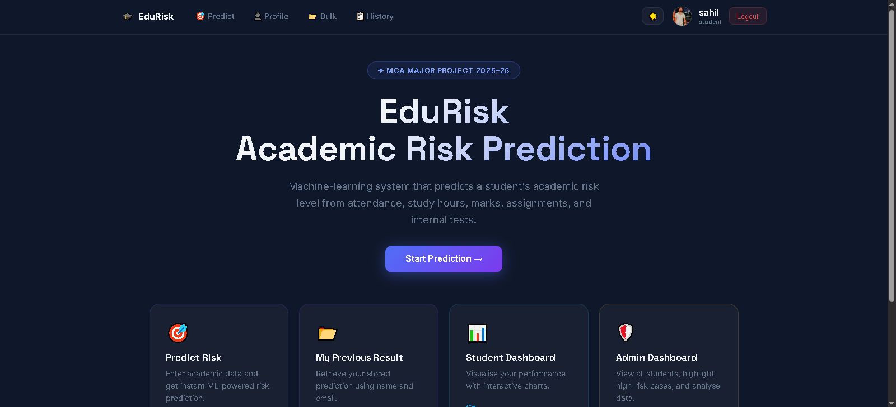
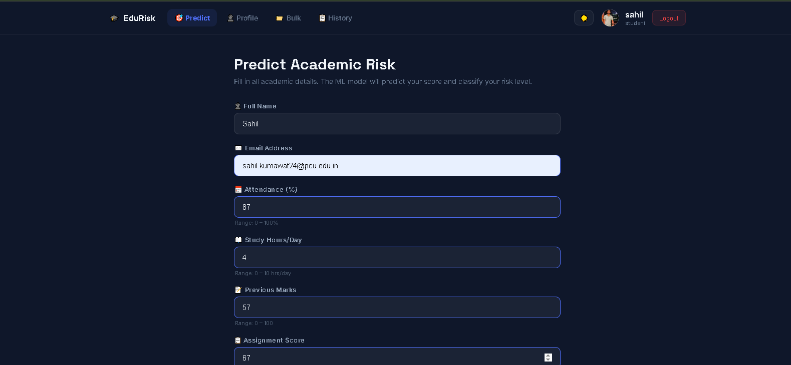
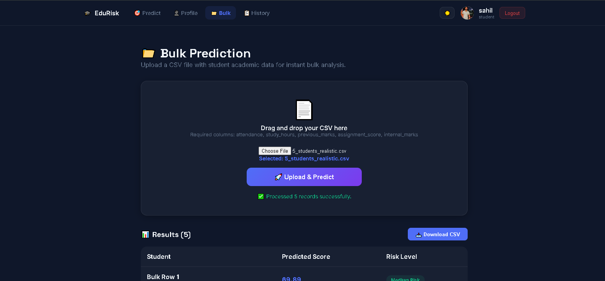
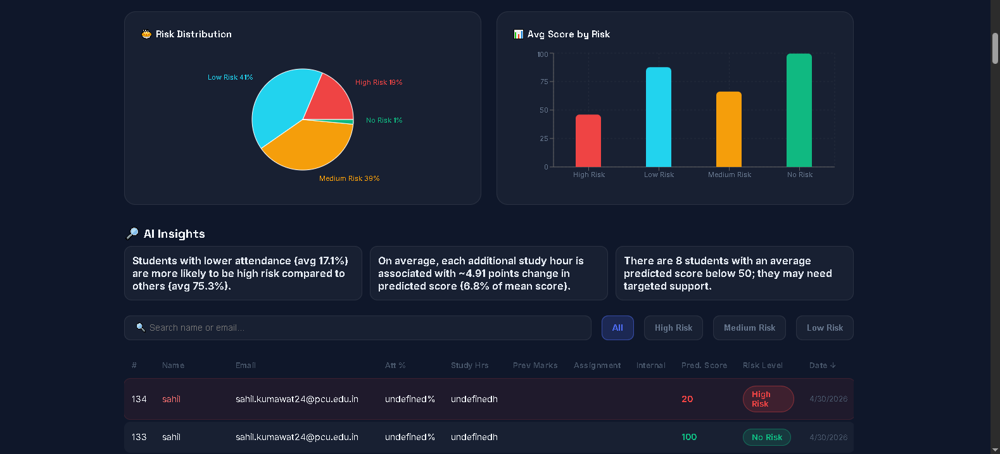
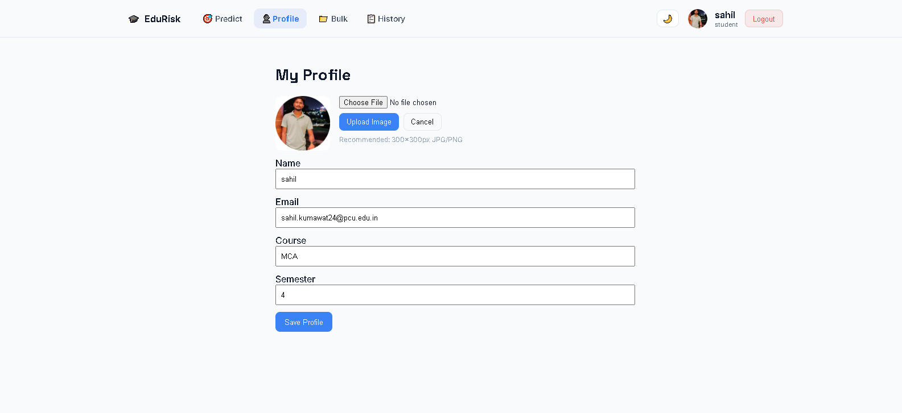
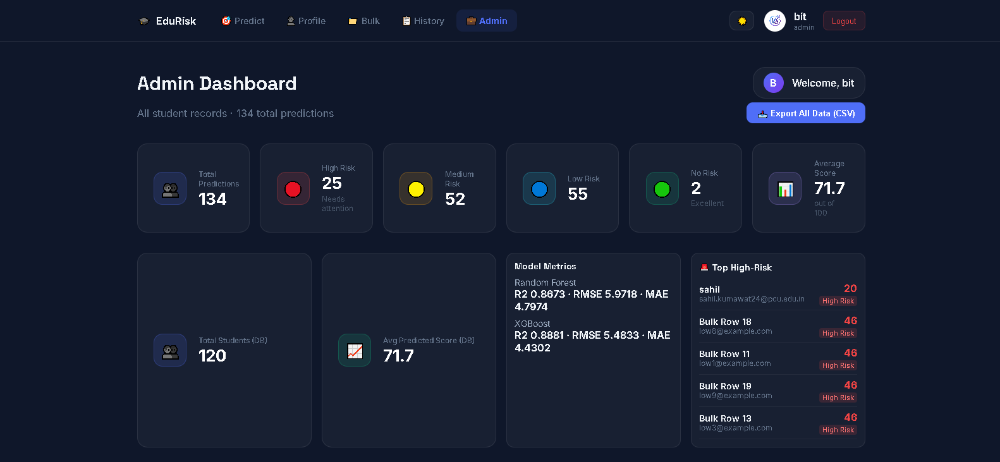

# EduRisk — Student Academic Risk Prediction System
**MCA Major Project | Pimpri Chinchwad University | 2025-26**

EduRisk is a comprehensive, AI-powered platform designed to identify students at risk of academic underperformance. It leverages Machine Learning (Random Forest & XGBoost) to predict final scores based on current academic metrics, and uses Generative AI (Google Gemini) to provide personalized, actionable insights.

---

## 📸 Screenshots

### 🔹 Home Page


### 🔹 Predict Page

<br/>


### 🔹 Result Page


### 🔹 Student Profile & Dashboard


### 🔹 Admin Dashboard

<br/>


---

## 🌟 Key Functionalities

### 1. 🔐 Security & Authentication (RBAC)
*   **JWT-Based Auth:** Secure user sessions using Flask-JWT-Extended.
*   **Role-Based Access Control:** Distinct experiences and route protection for `Admin` and `Student` roles.
*   **OTP Email Verification:** New users must verify their email addresses via a secure OTP sent upon registration.

### 2. 🤖 Machine Learning Pipeline
*   **Dual-Model Architecture:** Evaluates both **Random Forest** and **XGBoost** models, automatically selecting the one with the lowest RMSE.
*   **Full-Spectrum Training:** Trains on a dynamically generated synthetic dataset (10,000+ records) covering realistic 0–100 academic bounds.
*   **Explainable AI:** Uses SHAP-like feature importance tracking to explain *why* a model made a specific prediction.

### 3. 👨‍🎓 Student Features
*   **Predict Risk:** Submit current attendance, study hours, and assignment scores to get an instant risk assessment.
*   **Student Dashboard:** Visualize academic standing via interactive Radar and Bar charts.
*   **Profile Management:** Update personal details and upload profile photos.
*   **AI Insights:** Receive natural language feedback and actionable study plans generated by Google Gemini AI based on recent performance.

### 4. 👑 Admin Features
*   **Admin Dashboard:** High-level system analytics, including Risk Distribution (Pie Charts) and System Trends.
*   **Top High-Risk Tracking:** Dynamically tracks and lists the most critical students requiring immediate academic intervention based on their *latest* prediction.
*   **Bulk CSV Uploads:** Upload massive CSV files to generate predictions for hundreds of students simultaneously.
*   **Data Export:** Download detailed system analytics and prediction history as CSV reports.
*   **User Management:** Admins can view and manage all registered users in the system.

---

## 🛠️ Tech Stack

*   **Frontend:** React.js, Recharts, Framer Motion, Axios, React Router v6
*   **Backend:** Python 3, Flask, Flask-CORS, Flask-JWT-Extended, Flask-Bcrypt
*   **Machine Learning:** Scikit-Learn, XGBoost, Pandas, NumPy
*   **Generative AI:** Google Gemini API (`google.generativeai`)
*   **Database:** MySQL 8.0+

---

## 📁 Project Structure

```text
edurisk/
├── backend/
│   ├── app.py                   # Flask App Entry & Global Config
│   ├── blueprints/              # Modular routing (auth, admin, student, predict)
│   ├── database/                # Connection pooling and setup
│   ├── model/                   # ML dataset generator & training pipeline
│   ├── utils/                   # Decorators (JWT), Email Sender, GenAI integration
│   └── requirements.txt
└── frontend/
    ├── src/
    │   ├── api/                 # Global Axios interceptors & endpoints
    │   ├── components/          # Reusable UI (StatCard, RiskBadge)
    │   ├── context/             # AuthContext & ThemeContext
    │   └── pages/               # React screens (AdminDashboard, LoginPage, etc.)
    └── package.json
```

---

## ⚙️ Prerequisites

- Python 3.9+
- Node.js 18+
- MySQL 8.0+ (running locally)
- A valid Google Gemini API Key
- An App Password for a Gmail account (for OTP emails)

---

## 🚀 Setup & Installation

### 1. Database Configuration
Ensure MySQL is running. Create a `.env` file in the `backend/` folder:
```env
# backend/.env
JWT_SECRET_KEY=your_super_secret_jwt_string
DB_HOST=localhost
DB_USER=root
DB_PASSWORD=your_mysql_password
DB_NAME=edurisk_db

MAIL_USER=your_email@gmail.com
MAIL_PASS=your_gmail_app_password

GEMINI_API_KEY=your_google_gemini_key
```
*Note: The backend will auto-create the tables on first boot.*

### 2. Run Backend
```bash
cd edurisk/backend
pip install -r requirements.txt

# Start the Flask server (Trains ML model on first boot)
python app.py
```
*Backend runs on: **http://localhost:5000***

### 3. Run Frontend
```bash
cd edurisk/frontend
npm install

# Start the React development server
npm start
```
*Frontend runs on: **http://localhost:3000***

---

## 📊 Risk Classification Logic
Risk levels are rigidly defined to prevent overlap and ensure clear actionability:

| Score Range | Risk Level     | Meaning                                   |
|-------------|----------------|-------------------------------------------|
| 90 – 100    | **No Risk**    | Exceptional performance, keep it up.      |
| 75 – 89     | **Low Risk**   | Good standing, minor improvements needed. |
| 65 – 74     | **Medium Risk**| Borderline performance, intervention suggested. |
| < 65        | **High Risk**  | Critical warning, immediate help required.|

---
*Developed for Early Academic Risk Detection.*
